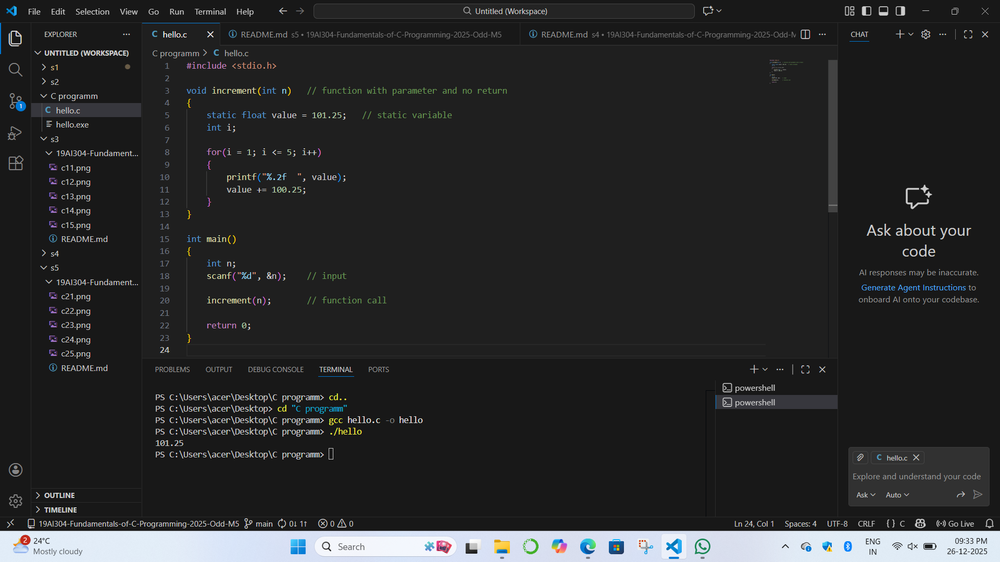
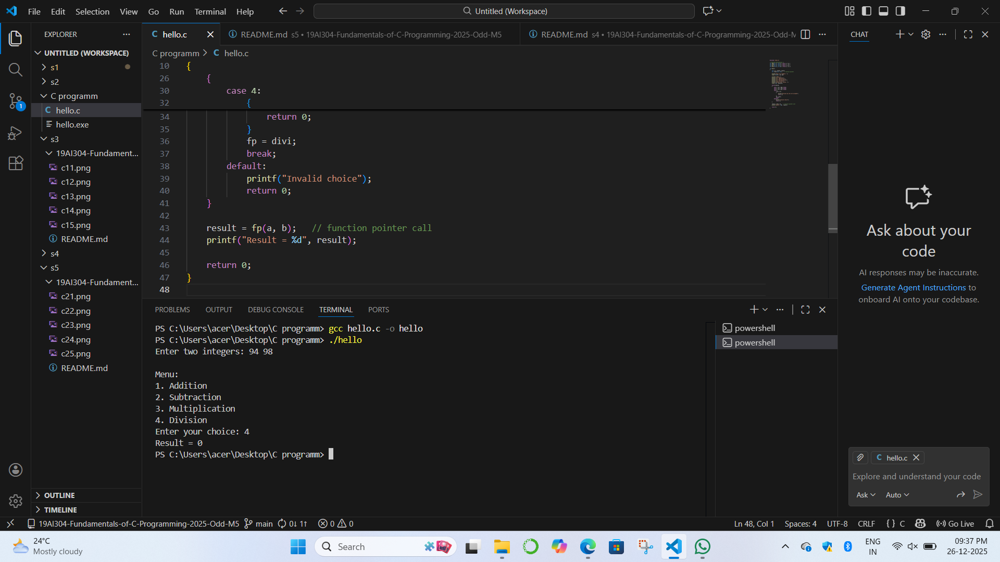
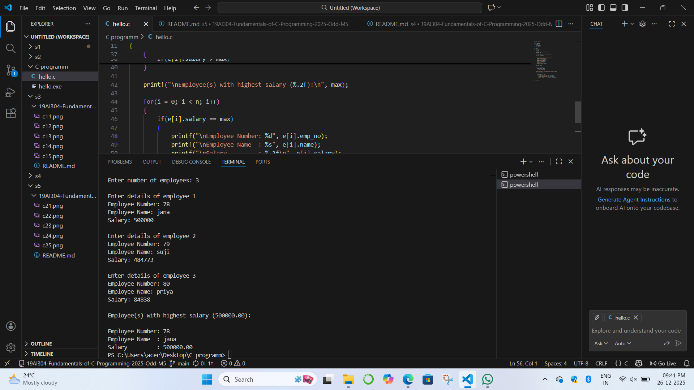
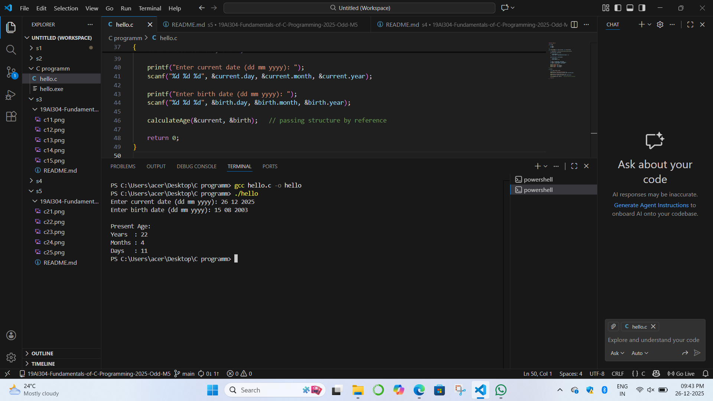

# 19AI304-Fundamentals-of-C-Programming-2025-Odd-M6
# IAPR-6- Module 6 - FoC
## 11. Implementation of the concept of pointer to function.
## 12. Implementation of programs using structure and union.
## 13. Implementation of programs for different storage classes.
# Ex.No:26
  Develop a C program using static storage class in function with parameter and without return to display the incremental float values as indicated in the following output.
| Input | Output                                       |
|-------|----------------------------------------------|
| 1     | 101.25&nbsp;&nbsp;201.50&nbsp;&nbsp;301.75&nbsp;&nbsp;402.00&nbsp;&nbsp;502.75 |
# Date : 18.12.25
# Aim:
To develop a C program using the static storage class in a function with a parameter and without a return value to display the required output.
# Algorithm:
### Step 1:
  Start
### Step 2: 
  Include the standard input-output library: #include<stdio.h>.
### Step 3:
  a. Declare an integer variable `input` to store the user’s number.  
  b. Inside the function `display(int n)`, declare a static float variable `base` and initialize it to 100.25.
### Step 4:
  Read an integer from the user and store it in `input`.
### Step 5:
  Call the function `display(input)` five times.
### Step 6:
  Inside the `display` function, for each call:  
  a. Calculate the sum of `base` and `n`.  
  b. Display the value.  
  c. Increase the value of `base` by 100.25.
### Step 7:
  Repeat Step 6 for all function calls.
### Step 8:
  Stop
# Program:
```
#include <stdio.h>

void increment(int n)   // function with parameter and no return
{
    static float value = 101.25;   // static variable
    int i;

    for(i = 1; i <= 5; i++)
    {
        printf("%.2f  ", value);
        value += 100.25;
    }
}

int main()
{
    int n;
    scanf("%d", &n);    // input

    increment(n);       // function call

    return 0;
}
```
# Output:

# Result: 
Thus, the program was implemented and executed successfully, and the required output was obtained.


# 19AI304-Fundamentals-of-C-Programming-2025-Odd-M6
# IAPR-6- Module 6 - FoC
# Ex.No:27
  Implement a C program to perform arithmetic operations (addition, subtraction, multiplication, division) on two integers using function pointers. The user should input two numbers and select the desired operation from a menu.
# Date : 18.12.25
# Aim:
  To implement a C program that uses function pointers to perform arithmetic operations (add, subtract, multiply, divide) on two integers based on user choice.
# Algorithm:
### Step 1:
  Start
### Step 2: 
  Include the standard input-output library: #include<stdio.h>.
### Step 3:
  Declare four functions to perform arithmetic operations:  
  - `add(int a, int b)`  
  - `subtract(int a, int b)`  
  - `multiply(int a, int b)`  
  - `divide(int a, int b)`
### Step 4:
  Declare a function pointer `int (*operation)(int, int)` to point to any of the arithmetic functions.
### Step 5:
  Input two integers from the user (`num1` and `num2`).
### Step 6:
  Display a menu for the user to choose an operation:  
  - Add  
  - Subtract  
  - Multiply  
  - Divide
### Step 7:
  Read the user’s choice.
### Step 8:
  Use a switch statement to assign the function pointer `operation` to the appropriate function based on the user’s choice.  
  - **Step 8.1:** If the choice is 4 (divide), check if the second number is zero. If yes, display an error and terminate.  
  - **Step 8.2:** If the choice is invalid, display an error and terminate.
### Step 9:
  Call the function using the function pointer and store the result in a variable `result`.
### Step 10:
  Display the result.
### Step 11:
  Stop
# Program:
```
#include <stdio.h>

/* Function declarations */
int add(int a, int b) { return a + b; }
int sub(int a, int b) { return a - b; }
int mul(int a, int b) { return a * b; }
int divi(int a, int b) { return a / b; }

int main()
{
    int a, b, choice, result;
    int (*fp)(int, int);   // function pointer

    printf("Enter two integers: ");
    scanf("%d %d", &a, &b);

    printf("\nMenu:");
    printf("\n1. Addition");
    printf("\n2. Subtraction");
    printf("\n3. Multiplication");
    printf("\n4. Division");
    printf("\nEnter your choice: ");
    scanf("%d", &choice);

    switch(choice)
    {
        case 1: fp = add; break;
        case 2: fp = sub; break;
        case 3: fp = mul; break;
        case 4:
            if(b == 0)
            {
                printf("Division by zero not allowed");
                return 0;
            }
            fp = divi;
            break;
        default:
            printf("Invalid choice");
            return 0;
    }

    result = fp(a, b);   // function pointer call
    printf("Result = %d", result);

    return 0;
}
```
# Output:
:

# Result: 
Thus, the program was implemented and executed successfully, and the required output was obtained.

# 19AI304-Fundamentals-of-C-Programming-2025-Odd-M6
# IAPR-6- Module 6 - FoC
# Ex.No:28
  Develop a C program to store details of n employees (employee number, name, and salary) using structures, and display the employee(s) with the highest salary.
# Date : 18.12.25
# Aim:
  To develop and implement a C program that uses a structure to store employee details (employee number, name, and salary) and determine the employee(s) with the highest salary.
# Algorithm:
### Step 1:
  Start
### Step 2: 
  Include the standard input-output library: #include<stdio.h>.
### Step 3:
  Define a structure `employee` with the following members:  
  - `eno` (employee number)  
  - `ename` (employee name)  
  - `salary` (employee salary)
### Step 4:
  Declare an array of structures to store details of multiple employees.
### Step 5:
  Input the number of employees, `n`.
### Step 6:
  For each employee (`i = 0` to `n-1`), do the following:  
  - **Step 6.1:** Input employee number.  
  - **Step 6.2:** Input employee name (allow spaces).  
  - **Step 6.3:** Input employee salary.  
  - **Step 6.4 (Optional):** Print the entered details for verification.
### Step 7:
  Initialize a variable `high` with the salary of the first employee.
### Step 8:
  For each employee (`i = 1` to `n-1`), do the following:  
  - **Step 8.1:** Compare employee salary with `high`.  
  - **Step 8.2:** If the salary is greater than `high`, update `high` with this salary.
### Step 9:
  Print the details of employee(s) whose salary matches `high`:  
  - **Step 9.1:** Loop through all employees.  
  - **Step 9.2:** If employee salary equals `high`, print employee number, name, and salary.
### Step 10:
  Stop
# Program:
```
#include <stdio.h>

struct employee
{
    int emp_no;
    char name[50];
    float salary;
};

int main()
{
    int n, i;
    float max;
    
    printf("Enter number of employees: ");
    scanf("%d", &n);

    struct employee e[n];   // structure array

    for(i = 0; i < n; i++)
    {
        printf("\nEnter details of employee %d\n", i + 1);

        printf("Employee Number: ");
        scanf("%d", &e[i].emp_no);

        printf("Employee Name: ");
        scanf("%s", e[i].name);

        printf("Salary: ");
        scanf("%f", &e[i].salary);
    }

    max = e[0].salary;

    for(i = 1; i < n; i++)
    {
        if(e[i].salary > max)
            max = e[i].salary;
    }

    printf("\nEmployee(s) with highest salary (%.2f):\n", max);

    for(i = 0; i < n; i++)
    {
        if(e[i].salary == max)
        {
            printf("\nEmployee Number: %d", e[i].emp_no);
            printf("\nEmployee Name  : %s", e[i].name);
            printf("\nSalary         : %.2f\n", e[i].salary);
        }
    }

    return 0;
}
```
# Output:



# Result: 
Thus, the program was implemented and executed successfully, and the required output was obtained.


# 19AI304-Fundamentals-of-C-Programming-2025-Odd-M6
# IAPR-6- Module 6 - FoC
# Ex.No:29
  Create the C program to calculate the present age of a person by passing structure as a reference.
# Date : 18.12.25
# Aim:
  To create a C program that uses a structure to store the current date and birth date, and to calculate the person’s present age in years, months, and days by passing the structure as a reference.
# Algorithm:
### Step 1:
  Start
### Step 2: 
  Include the standard input-output library: #include<stdio.h>.
### Step 3:
  Define a structure named `date` with members to store:  
  - Current date (`c_date`, `c_month`, `c_year`)  
  - Birth date (`b_date`, `b_month`, `b_year`)  
  - Calculated age (`cal_date`, `cal_month`, `cal_year`)
### Step 4:
  Initialize a structure variable with the current date and birth date values.
### Step 5:
  Pass the structure variable to a function `findAge()` by reference.
### Step 6:
  Inside `findAge()`:  
  - a. Declare an integer array `month[]` to store the number of days in each month.  
  - b. If the birth date is greater than the current date:  
     - Add the number of days of the previous month to the current date.  
     - Decrease the current month by 1.  
  - c. If the birth month is greater than the current month:  
     - Decrease the current year by 1.  
     - Add 12 to the current month.  
  - d. Calculate the age in days, months, and years by subtracting the corresponding birth values from the current values.
### Step 7:
  Return the structure pointer containing the calculated age.
### Step 8:
  Display the calculated age (years, months, and days) in the `main` function.
### Step 9:
  Stop
# Program:
```
#include <stdio.h>

struct date
{
    int day;
    int month;
    int year;
};

void calculateAge(struct date *current, struct date *birth)
{
    int daysInMonth[] = {31,28,31,30,31,30,31,31,30,31,30,31};

    if(current->day < birth->day)
    {
        current->month--;
        current->day += daysInMonth[birth->month - 1];
    }

    if(current->month < birth->month)
    {
        current->year--;
        current->month += 12;
    }

    int days = current->day - birth->day;
    int months = current->month - birth->month;
    int years = current->year - birth->year;

    printf("\nPresent Age:");
    printf("\nYears  : %d", years);
    printf("\nMonths : %d", months);
    printf("\nDays   : %d", days);
}

int main()
{
    struct date current, birth;

    printf("Enter current date (dd mm yyyy): ");
    scanf("%d %d %d", &current.day, &current.month, &current.year);

    printf("Enter birth date (dd mm yyyy): ");
    scanf("%d %d %d", &birth.day, &birth.month, &birth.year);

    calculateAge(&current, &birth);   // passing structure by reference

    return 0;
}
```
# Output:


# Result: 
Thus, the program was implemented and executed successfully, and the required output was obtained.


# 19AI304-Fundamentals-of-C-Programming-2025-Odd-M6
# IAPR-6- Module 6 - FoC
# Ex.No:30
  Build a C program to demonstrate the use of a pointer to a union. Store an integer value in a union, access it using a union pointer, and display it as both an integer and a character.
# Date : 18.12.25
# Aim:
  To build a program in C that uses a pointer to a union to store an integer value and display it in both integer and character format.
# Algorithm:
### Step 1:
  Start
### Step 2: 
  Include the standard input-output library: #include<stdio.h>.
### Step 3:
  Define a union `abc` with the following members:  
  - `int a`  
  - `char b`
### Step 4:
  Declare a union variable `var` of type `abc`.
### Step 5:
  Declare a pointer `ptr` of type `union abc*`.
### Step 6:
  Assign the address of `var` to `ptr`.
### Step 7:
  Store an integer value (e.g., 90) in `var.a`.
### Step 8:
  Access and print the value of `a` using the pointer `ptr` in integer format.
### Step 9:
  Access and print the same value using the pointer `ptr` in character format.
### Step 10:
  Stop
# Program:
```
#include <stdio.h>

union data
{
    int i;
    char c;
};

int main()
{
    union data d;          // union variable
    union data *ptr;       // pointer to union

    ptr = &d;              // pointer points to union

    ptr->i = 65;           // store integer value

    printf("Integer value   : %d\n", ptr->i);
    printf("Character value : %c\n", ptr->c);

    return 0;
}
```
# Output:


# Result: 
Thus, the program was implemented and executed successfully, and the required output was obtained.


